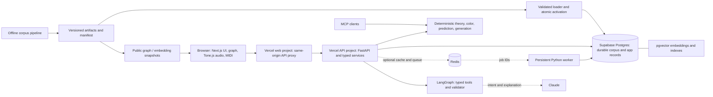

# Harmonic Color Graph — Andrew Carlins demo

Prepared September 28, 2026. Format: 20 minutes, followed by Q&A.

## Read this first

The core demo has passed an independent browser check against real production APIs. The assistant is restored and its recommendation flow passed both API and browser checks. The complete production feature set has **not** passed. Similarity, the embedding map, stored graph color profiles, Redis/worker operations and the private admin dashboard remain outside the verified live route.

Use the local frontend at **http://127.0.0.1:3000**, connected to the production API, for the repaired A/B/C color display. The public site is **https://harmonic-color-graph.vercel.app**. At the initial rehearsal the display repair was local; after its PR merges, verify the public deployment before switching the demo to it. Do not switch between these environments without saying which one is running.

The audit is in the app's `.agent-logs/demo-2026-09-28/readiness.md`. Actual screenshots, responses and a downloaded MIDI are preserved there or in its parent directory. Browser playback enters its playing state and stops correctly; you still need to hear it through your meeting audio setup.

## The story to tell

“I built Harmonic Color Graph to help a musician answer three questions: what is happening in these chords, what could I try next, and how does the difference sound? It connects inspectable music theory, patterns from a chord corpus, and playable exploration. The aim is to shorten the distance between a musical question and something useful you can hear.”

Play Anything describes its products as turning recordings into transcriptions and interactive practice, with Songscription and Anything Piano serving learners, teachers and musicians. That makes understanding and experimenting with playable music a relevant conversation. This is a proposed connection to their product, not a claim about their roadmap. [Play Anything](https://playanything.com/), [Anything Piano](https://playanything.com/anythingpiano).

Your connection: “After someone gets playable material from a song, there is another opportunity: help them understand a difficult passage, hear a simpler or different accompaniment, and find a satisfying next step. This project explores that layer.” There is no audio transcription or Play Anything integration in this project today.

## Rehearsal and setup

1. Use desktop Chrome on the presentation machine. Connect power and disable sleep for the meeting. Set screen-share zoom so the labels are readable.
2. In the exact meeting setup, play one progression and check that Andrew would receive computer audio. Click Play yourself to unlock browser audio. Start with the synth; test the optional piano before using it.
3. Open the five core tabs below. Keep generation results open: a real generation request took about **24 seconds** during this audit. Do not repeatedly generate while explaining another feature.
4. Download one MIDI beforehand and leave its folder accessible. The audited export contained one track, 16 notes and 120 BPM. A DAW import is optional and must be rehearsed separately.
5. Keep the screenshots and this document open as backups. If a request fails or takes too long, use the verified capture and explain its environment. Never describe a fixture as a live corpus result.
6. Reserve the last 15–20 minutes before the meeting for a complete rehearsal, not new infrastructure changes.

Tabs (replace the origin with the public site only if using production):

- Analysis: http://127.0.0.1:3000/?p=D7-G-C&k=C-major
- Recommendations: http://127.0.0.1:3000/?p=C-G-Am&k=C-major
- Substitutions: http://127.0.0.1:3000/?p=C-G-Am-F&k=C-major
- Generate and compare: http://127.0.0.1:3000/generate?p=C-G-Am&k=C-major
- Graph: http://127.0.0.1:3000/explore
- Assistant: https://harmonic-color-graph.vercel.app/assistant

**Verified assistant prompt:** “Recommend the next chord after C G Am in C major”. The direct API check completed in 7.12 seconds with `fallback=false`, no errors, F as its candidate and three cited claims. The browser repetition also returned a grounded F recommendation, expandable citations and working simple/technical views. Keep the already-open result as a backup. “Explain D7 G C in C major” completed in 18.4 seconds using deterministic fallback after explanation validation failed; do not use it as the main model demo. These checks establish the rehearsed flow, not a general assistant quality benchmark. Production API deployment: `dpl_Dp6Zp41Cipt2TqrrfXUjhiMfedrt`, unchanged source `098b3fd`, with the two private assistant settings configured. The existing $2 daily model budget remains in place.

These links restore progression, key and optional genre/section. They do not serialize every slider, generated result or playback setting. Rehearse the actual clicks rather than expecting every screen state to survive a reload.

## The 20-minute run of show

| Time | Show and say | Consumer value | Engineering point |
|---|---|---|---|
| 0:00–1:00 | Give the opening above. State that the input is chord symbols. | A learner or songwriter understands the job immediately. | Scope a specific useful interaction and make the output audible. |
| 1:00–4:00 | Analyze **D7 – G – C**, with **C major** supplied. Point to **V7/V → V → I** and secondary-dominant resolution. Play it. Briefly clear the key for an ambiguous loop such as C – Am – F – G to show competing key interpretations. | “Why does this chord lead naturally into the next one?” A teacher can explain a passage; a learner can relate chords to function. | Preserve spelling, bass/inversion, absolute chord identity and transposition-independent function. Supplied key is an override, not an inferred 100% certainty. |
| 4:00–7:00 | Analyze **C – G – Am**. Show **F** ranked first in the audited corpus result. Expand its evidence. Switch to the Generate tab and show preloaded **A Common: F / B Darker: Fm / C Surprising: Cm**. Play two options. | Escape the blank page while keeping creative control. | Separate observed frequency from preference. Intent reranks plausible candidates; it does not establish musical truth. |
| 7:00–9:00 | On **C – G – Am – F**, click **G**, inspect substitutes, preview one, then use **F** to produce **C – F – Am – F**. Show the color profile and an explanation/confidence. | An arranger changes one moment while retaining context. A listener can compare rather than learn every label first. | Score replacement chords against both neighbors. Distinguish measurable features from interpretive emotional descriptions. |
| 9:00–11:00 | Open Graph Explorer. Show a neighborhood, the accessible list, probability/evidence, then the rehearsed **I → bVI** path and Play path. | Discover a route between two harmonic destinations; inspect why a transition is available. | Indexed graph data and bounded path search. Mention snapshot fallback; do not disable the network in the main demo. |
| 11:00–13:00 | Show pre-generated paths: **Am – D7 – G7 – C**, **C – G – F – C**, **Cmaj7 – Bm7 – E7 – Am7** were returned in the audit. Explain length, endpoints, cadence and tension-curve controls. Play a path, export MIDI, send it to Workbench. | Turn an idea into a practice loop or material for a DAW. | Hard constraints prune invalid paths; soft objectives rank the remaining choices. Export completes the user's task. |
| 13:00–15:00 | Ask **Recommend the next chord after C G Am in C major**. Show workflow steps, the F answer, cited facts and playable option. Toggle Technical and expand Cited facts. Use the preloaded answer if a fresh request fails or falls back; acknowledge that change. | Ask in ordinary language without knowing which screen or theory term to use. | Typed tools produce musical facts; the model interprets and explains. Validate before streaming answer text. |
| 15:00–18:00 | Walk the architecture diagram and file map below. Briefly cover similarity/MCP, the offline pipeline, worker and observability, with their actual readiness labels. | Related-pattern discovery and reuse across interfaces are the next useful capabilities. | Clear boundaries, one shared domain layer, cost control, reproducible data and recoverable jobs. |
| 18:00–20:00 | Give the hiring argument, one honest limitation and one proposed product experiment. Ask Andrew which part of their learning journey currently has the most friction. | Bring the conversation back to a real user and a measurable next step. | Show judgment, ownership and willingness to learn from evidence. |

If Andrew interrupts with technical questions, keep the analysis → audition → export sequence intact and move the complete feature inventory into Q&A. Twenty minutes cannot accommodate a separate deep dive into every backend feature.

## Complete implemented-feature inventory

“Implemented” describes code, not automatic production acceptance. The current audit is the authority for demo status.

| Feature group | What it does / use case | Status and presentation |
|---|---|---|
| Chord normalization, spelling, extensions, slash bass and inversions | Keeps a musician's notation meaningful; e.g. C/E retains its bass. | Analysis live-tested; use richer notation as a Q&A example after rehearsal. |
| Key distribution, ambiguity, local keys and modulation logic | Represents uncertainty and section context instead of forcing a single explanation. | Key/ambiguity browser scenarios passed. Recent relative-key corrections exist in draft PR #48; production is an older revision. Do not imply all corrections are deployed. |
| Functional Roman numerals and relationship catalog | Applied dominants, borrowing, cadences, common tones and other relationships with traceable facts. | D7 – G – C live-tested. Explain the label and then let the listener hear it. |
| Statistical next-chord prediction | Uses several prior functions and backs off when history/context is sparse. Genre and section are optional context. | Live-tested; F ranked first after C – G – Am. Counts are observations, not unique users or necessarily unique songs. |
| Intent and hybrid ranking | Corpus candidates, theory expansions and optional embedding neighbors; presets and seven controls: brightness, tension/relaxation, surprise, complexity, resolution/open-endedness, smoothness and dreaminess. | Three live intent scenarios passed. Missing embeddings mean this is not a demo of vector-enhanced candidate coverage. |
| Contextual substitutions | Replaces a selected chord using both left and right context and optional constraints. | Actual UI search/apply passed; progression playback controls verified. Rehearse the substitute-preview button before relying on it. |
| Harmonic color | Nine raw axes: chromaticity, brightness, tension, stability, surprise, smoothness, complexity, resolution, finality. Six perceptual axes: nostalgia, dreaminess, melancholy, warmth, openness, cinematic quality. | Submitted-progression color endpoint works without stored profiles; surprise can be absent without a predictor. Perceptual axes are derived/rule-based associations with confidence, not objective emotional measurements. |
| Voice leading and playback | Chooses voicings with small movements; browser synth/optional piano, tempo, loop, highlight and sequential compare. | Playing/stopping verified in browser. Physical sound and piano sample loading require your rehearsal. |
| Constrained generation and tension arcs | Length 2–16, key, endpoints, cadence and other constraints; beam search and diverse results. Custom curve controls exist. | Real generation and MIDI passed; pre-generate because latency was about 24 seconds. Do not quote the design target as measured performance. |
| A/B/C comparison and MIDI export | Audition alternatives, inspect deltas, export voicings/tempo and move results between screens. | Live corpus comparison passed on local frontend after field-mapping repair. The initial production audit showed the old defect; verify the public display after the repair deploys. |
| Graph neighborhoods, filters, path search, evidence and examples | Explore transitions and connect destinations. Accessible list provides a second interface. | Neighborhood and I → bVI path passed. Some perceptual tints/details are empty because stored color profiles are missing. |
| Graph snapshot fallback | Keeps a small graph explorable during API/database outages. | Public snapshot exists; controlled outage browser test passes. It is a bounded snapshot, not a complete offline copy of the corpus. |
| Structural/surface similarity and embedding map | Find related patterns, flag rotations, inspect learned neighborhoods and open a point in Workbench. | Both production search modes currently fail due to embedding configuration; map is absent. Explain implementation. Older cv-embed-smoke artifacts have matching content hashes, but are not the corrected production corpus. |
| Grounded assistant | Intent → tools → explanation validation → one repair or deterministic fallback; SSE steps and final result, facts, playback and links. | Recommendation prompt passed with model-backed explanation, plus a browser repetition. Explanation prompt fell back. A 200 response with fallback=true is not proof of a model answer. |
| Ten typed tools and MCP | Analysis, recommend, substitute, generate, explain transition, similar progressions, graph path, examples, color, playback. Reusable by an external AI client. | Implementation/tests; optional technical walkthrough. No arbitrary SQL/file access is exposed by these tools. |
| Versioned corpus pipeline and loader | Ingest/dedupe/analyze, aggregate n-grams/graph/patterns, build colors/embeddings/snapshots; manifests and atomic activation. | Code and offline evaluation evidence. No live build or database reload during the demo. |
| Queue, worker, retry, idempotency and dead letters | Move long jobs out of requests; persist job state and recover interrupted work. | Implemented; production worker/Redis prerequisites remain open. Show architecture/tests, not a fictitious completed job. |
| Caching, limits, cost reservations and telemetry | Bounded latency/cost, version-scoped cache, trace IDs, request metrics, private admin, optional LangSmith. | Explain implementation. Assistant limits/budget are Postgres-backed. Redis/admin/complete tracing are not verified live. |
| Shared URLs, accessible UI, attribution, API schemas and CI | Share a starting progression, navigate by keyboard/list view, inspect data source and preserve client/server contracts. | Relevant browser flows and frontend checks passed. Not proof of every mobile/Safari acceptance gate. |

Accounts, saved libraries, learned taste profiles, a user-feedback learning loop and commercial launch are future M8 work. Do not present them as shipped.

## Architecture: what runs where

The **Vercel API is your Python backend hosted by Vercel**, not a separate music database and not an LLM. The browser calls `/api/hcg/...` on the web origin; `next.config.ts` forwards that request to the FastAPI project. FastAPI validates input, calls the shared domain services, queries derived data as needed and returns typed JSON or assistant SSE. Browser audio is synthesized locally; the server sends notes/voicings rather than streaming a song recording.

**Supabase is the hosted Postgres service.** The `hcg` schema stores versioned graph nodes/edges, transition and n-gram counts, patterns/examples/facts, color norms/profiles, embeddings, active corpus versions, durable jobs and AI/request logs. SQL indexes support lookup; pgvector adds vector similarity in the same database. Supabase is not currently being used to imply a shipped account/auth experience. Empty tables or absent active models still require a deliberate load.

**Redis is disposable coordination/cache state.** Postgres owns durable job truth; Redis queues job IDs. A persistent worker claims jobs with leases, updates progress, retries transient failures and records terminal failures. A serverless request is unsuitable for an hours-long corpus build. The assistant separately uses Postgres for its IP counters and cost accounting.

**Offline build, online serve.** Corpus analysis and ML dependencies run outside the request path. Hashed artifacts and a manifest make a build inspectable; a versioned loader enables validation before activation. The production function excludes pipeline/test/Parquet contents. This keeps request-time work bounded, although measured generation latency still needs improvement.

## File map for the technical walkthrough

The Git root is `C:/Users/sidds/Documents/Codex/2026-09-26/to-create-my-own-unique-way/work/hcg-f60`. The application root is its `harmonic-color-graph` directory. Paths below are relative to that application root.

| Location | Open it to explain |
|---|---|
| `app/` | Next.js route shell: Workbench `/`, `/explore`, `/generate`, `/similar`, `/assistant`, `/about`, `/admin`. |
| `components/workbench-v2.tsx`, `generator.tsx`, `graph-explorer.tsx`, `similarity-explorer.tsx`, `assistant.tsx` | User workflows and state; component names correspond directly to screens. |
| `lib/api/client.ts`, `types.ts`, `assistant.ts` | Typed requests, generated API contracts and SSE handling. |
| `lib/music/engine.ts`, `midi-export.ts`; `lib/hooks/use-playback.ts` | Tone.js playback scheduling, voicings and MIDI export. |
| `lib/progression-url.ts`; `next.config.ts` | Shareable progression state; web-to-API rewrite. |
| `backend/app/main.py`, `api/`, `schemas/` | FastAPI composition, endpoint adapters and validated contracts. |
| `backend/app/theory/`, `color/` | Chord/key/Roman/relationship/voice-leading logic; raw and perceptual color. |
| `backend/app/predict/`, `recommend/`, `services/`, `graph/` | N-gram prediction, multi-source scoring, substitutions, generation, similarity and paths. |
| `backend/app/db/`, `supabase/migrations/` | SQLAlchemy/psycopg access and the single numbered SQL migration history. |
| `backend/app/ai/`, `backend/app/mcp/` | Typed tools, LangGraph workflow, grounding rules, usage accounting and MCP transports. |
| `backend/app/jobs/`, `backend/app/core/` | Durable job behavior, Redis adapter, settings, cache and telemetry. |
| `backend/pipeline/`, `data/` | Corpus build/loader and local raw/derived artifacts. Large raw data is excluded from Git. |
| `public/snapshot/`, `public/samples/` | Browser graph/map assets and audio samples. |
| `backend/tests/`, `tests/e2e/`, colocated `*.test.ts(x)` | Theory/property/API/evaluation tests, Playwright user flows and frontend unit tests. |
| `docs/adr/`, `docs/eval/`, `feature-specs/v2/`, `scripts/check.py` | Decisions, measured reports, scope and repeatable gates. |

## Decisions you can defend

These explanations follow the implementation and recorded ADRs. Use first person only where they reflect your actual decisions; be explicit about AI-assisted implementation if asked.

| Decision | A concise explanation | Tradeoff you understand |
|---|---|---|
| Theory and statistics before the assistant | “I wanted inspectable musical results that every interface could reuse. Language makes those results easier to access.” | You own the correctness of the theory engine; model-only review does not replace musician listening. |
| Absolute chord + compact core + full Roman figure | “Compact function tokens pool evidence across keys; the richer display retains detail a musician cares about.” | Vocabulary design can discard useful distinctions, so keep the original chord and display figure too. ADR-003. |
| Postgres property graph plus pgvector | “The graph fits in relational tables, and I can keep graph, evidence and vectors together.” | Python owns bounded graph algorithms; revisit for substantially larger graphs or complex ad-hoc traversals. ADR-002. |
| Offline preprocessing and small runtime | “Heavy corpus work happens once per version, rather than making every musician wait for it.” | Loading and activating the matching artifacts is an operational responsibility. ADR-001. |
| In-house fast theory; music21 as a development oracle | “I cross-check against a mature library without importing its full weight into every serverless invocation.” | An oracle can disagree; investigate with gold cases and musical reasons. ADR-004. |
| Context backoff, baseline and held-out evaluation | “Sparse contexts should borrow support, and complexity has to earn its place against a simpler baseline.” | Current context mixing underperforms context-free prediction at higher orders; tune on development data, not the held-out test set. |
| Hybrid intent scoring with explanations | “Frequency answers what people often do; intent lets the user ask for a different creative direction.” | A surprising choice can become implausible. Plausibility floors and transparent contributions bound that tradeoff. |
| Separate raw color from perceptual associations | “I can measure pitch/theory properties, but I shouldn't tell every listener what they must feel.” | Associations need listener validation and may vary with rhythm, voicing, timbre and culture. |
| Audition, compare and export | “The shortest route to value is hearing and using an option, not reading a score from an algorithm.” | Web audio must be tested in real devices and meeting setups. |
| Typed tools, grounding and deterministic fallback | “The assistant can explain returned evidence. It can't invent a song example and present it as a retrieved fact.” | Validation can reject fluent answers; fallback protects function but is less expressive. ADR-006. |
| One migration history, storage budget, durable jobs | “I treat reproducibility, recovery and resource cost as part of the product.” | These add operational work; several production gates remain incomplete. ADR-005/007. |
| URL state and accessible list view | “Sharing and exploring should take few steps, including when a graph canvas is inconvenient.” | URL state does not currently replace accounts or persist a whole session. |

Data sourcing matters: the project's ADR-008 records Chordonomicon as CC BY-NC 4.0 and scopes this project as non-commercial. Do not pitch this corpus as ready to drop into Play Anything's commercial product. Pitch the engineering approach and a future integration using appropriately sourced data.

## Evaluation and hard questions

**“How do you know recommendations are better?”** The recorded offline prediction experiments compare against the prior bigram baseline on held-out songs, with train/test overlap checks. The headline is approximately **0.61 versus 0.54 MRR**. MRR averages the reciprocal rank of the actual next chord; it is not a 61% preference score or a user-retention metric. Context-free prediction is around **0.68**, which is evidence to simplify/tune the current policy. The corrected hybrid evaluation still has a coverage failure, so do not claim every quality gate passes.

**“What does your model learn?”** Next-function statistics and separately trained representations/ranking weights. Symbolic parsing and theory rules are deterministic. Perceptual labels are rule/feature derived. This is not an audio foundation model, and it does not learn an individual user's taste today.

**“Why is this useful beyond a chatbot?”** The same progression can be inspected, altered, auditioned, traversed in a graph and exported. The assistant is one interface to those capabilities, with evidence and downstream actions.

**“What is unfinished?”** Production embeddings/color materialization, persistent worker/Redis operations, parts of live assistant acceptance and observability, listening validation and performance. Say exactly which were restored today. Acknowledge the measured 24-second generation request and the offline coverage issue.

**“What would you simplify?”** Choose the smallest journey that gets a learner to an audible success. Keep the graph/deeper analysis available, but validate whether they improve that journey before making them the default. Prioritize latency and one clear next action before adding more algorithms.

**“How did AI contribute?”** Describe your real workflow: which product decisions you owned, what agents implemented, how you reviewed code and how tests/live checks caught mistakes. The A/B/C field-mapping bug is a concrete example: mocked data had mirrored the UI's assumption; a real API/browser check exposed it. Avoid claiming unaided authorship or validation you did not perform.

## Why Andrew should consider hiring you

Use evidence rather than claiming this demo guarantees a hiring outcome:

“What I want you to take away is that I can turn an ambiguous musical idea into a usable flow, carry it through the UI, backend and data layer, and check whether it actually helps. I care about the result a musician can hear, and I can explain the engineering tradeoffs underneath it. I also know how to separate what is implemented, what the tests cover, and what is actually ready for users.”

For **product engineering**, point to the complete edit → compare → hear → export journey, shared contracts, handling uncertainty, accessible alternatives, and diagnosing a real integration bug rather than stopping at a passing unit test.

For **growth engineering**, frame the features as hypotheses you can instrument. Shareable progressions, low-friction audition and export are potential activation/distribution mechanisms, not proven growth. You have not demonstrated revenue or retention lift in this project.

Propose a small experiment relevant to Play Anything: “For a learner with a newly generated arrangement, I would test one suggested next action, such as a short loop or a simpler accompaniment, against the current flow. The primary measure would be reaching a successful first practice interaction. I'd then check seven-day return and guardrails for musical quality, errors, latency and cost.” This is a proposal, not an integration or an established finding.

An illustrative first month: learn the existing funnel and support pain points; agree on one friction point and baseline; ship one small change behind controlled rollout; evaluate activation and quality together. Let Andrew's constraints determine the actual sequence.

Close with: “Where is the biggest gap today between a user bringing a song they love and having a first successful practice session? That's the kind of problem I'd like to own with your team.”

## Final preflight record

- Core browser flow: passed on local frontend against production APIs.
- Comparison repair: passed corrected Playwright regression and real-response browser check; verified locally; confirm the deployed revision after merge.
- Assistant: recommendation flow passed API and browser checks; separate explanation prompt used fallback. Full benchmark not rerun.
- Full-feature production gate: failed; do not relabel as passed.
- Physical meeting audio: **presenter must check**.
- Presentation plan: rehearse once end to end and freeze the setup.
